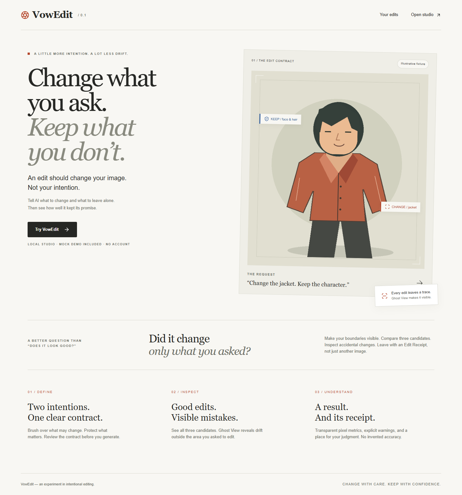
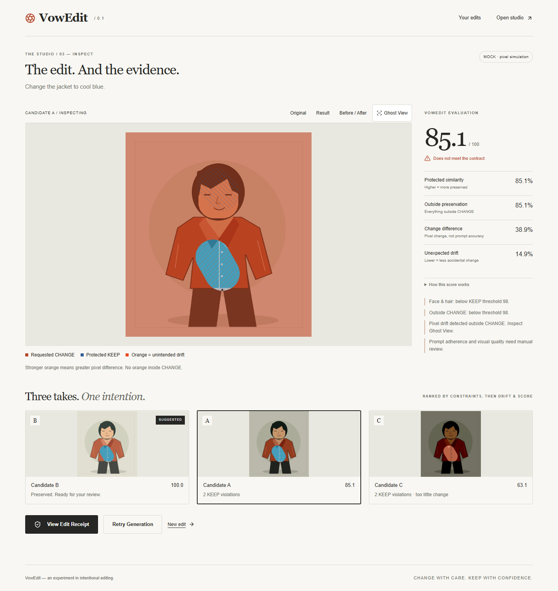

# VowEdit

**Change what you ask. Keep what you don’t.**

## Problem

Ask AI for a new jacket. Get a new face, too.
Generative editing can change more than the creator intended, and a good-looking result can hide it.

## Product idea

VowEdit makes two intentions explicit: **CHANGE** what may be edited, and **KEEP** what must stay.
It generates three candidates, measures preservation and unintended drift, ranks by constraints,
and explains the outcome in an Edit Receipt. The model is replaceable; the contract is the product.

## Demo

Open the studio and choose **Use Demo — image, instruction & masks** to load the project-owned original,
instruction and editable CHANGE/KEEP masks together. Review the contract and Generate. Alternatively,
upload an authorized image and paint your boundaries. Compare A/B/C, move the Before / After slider, inspect
Ghost View and export the receipt. Use the human-review field to judge prompt adherence.

**Mock mode is a deterministic pixel simulation, not AI inference.** It deliberately includes drift
and an incomplete edit. It works offline with no GPU or account. The code includes RunningHub and
local ComfyUI adapters, but **real cloud/local model generation is NOT TESTED**.

Why this matters: the result is not only “here is your image,” but “here is what changed, what stayed
protected, and where you should look more closely.” No pixel metric proves subjective quality.

## Screenshots

Captured from the running local Mock app, using project-owned fixtures:




The [current screenshot directory](docs/screenshots/final) includes 1440, 1024, 768, 430 and 390 pixel views of the landing,
mask editor, contract summary, processing, result, candidate comparison, Ghost View, receipt and failure.

## Quick Start

Requires Node 22.14–24.x and Python 3.10+ (local validation used Node 24 and Python 3.10).
Run from the repository root. Mock is the default; no `.env` is required.

```powershell
py -3.10 -m venv .venv
.\.venv\Scripts\python -m pip install -r requirements.lock
.\.venv\Scripts\python -m pip install --no-deps -e .
npm ci
.\.venv\Scripts\python -m uvicorn backend.api:create_app --factory --host 127.0.0.1 --port 8000
```

In a second terminal:

```powershell
npm run dev
```

Visit [the local studio](http://127.0.0.1:3000). On macOS/Linux use `python3 -m venv .venv`
and `.venv/bin/python` in place of the Windows Python command. These platforms have not been
locally exercised in this delivery. For a production frontend, `npm run build -- --webpack`, then
`npm start`; keep the FastAPI process running separately. Do not use multiple API workers.

Use `.env.example` for server-only settings. Never prefix provider keys with `NEXT_PUBLIC_`.
The generated `data/` directory holds the SQLite database and PNGs. Do not commit it.
This is a trusted-machine local prototype, not a public network service.

## Architecture

Next.js/React UI → FastAPI → ImageEditService → replaceable ImageEditProvider.
Independent evaluation → SQLite records + local PNG storage. Async jobs use one bounded worker,
unique request keys, transactional state changes and explicit retry domains. Refresh resumes polling;
an ambiguous submission retains its request key. Generation retries preserve the old run and reuse
the contract; evaluation retries preserve generated images and never call the provider.

See [repository audit](docs/REPOSITORY_AUDIT.md), [architecture decision](docs/ADR-001-VOWEDIT-ARCHITECTURE.md)
and the interviewer-oriented [Product Case](docs/PRODUCT_CASE.md).

## Provider model

| Provider | Code | Verification |
| --- | --- | --- |
| Mock | Implemented; default | Local unit, integration and real-browser tests |
| RunningHub | Implemented, fixed SD/SDXL graph, opt-in | Offline HTTP transport tests; real cloud NOT TESTED |
| Local ComfyUI | Implemented, loopback-only | Offline HTTP transport tests; real generation NOT TESTED |

See [RunningHub setup and official API references](docs/RUNNINGHUB_INTEGRATION.md),
[workflow requirements](workflows/README.md) and [model experiment boundary](docs/MODEL_BOUNDARIES.md).
No user checkpoint or actual cloud workflow is bundled. No model downloads or automatic paid retries.

## Evaluation

`rgb-mae-v1` compares normalized mean absolute RGB differences in aligned images. Protected similarity
and outside preservation are higher-is-better; unexpected drift is lower-is-better. CHANGE difference
measures pixels, not semantic success. At least 2% mean change is required to reject near-noops.

Score: 60% manual KEEP preservation + 40% outside preservation; outside preservation gets 100% if
there is no painted KEEP. Each hard threshold is tested before rounding. Rank by eligibility,
violation count, meaningful change, lower drift, score, then original candidate index. If nothing
qualifies, nothing is selected. All candidates and warnings remain available.

Ghost View colors only outside-CHANGE drift. Face identity, semantic adherence and artifact quality
are **not** automatically assessed. Receipts expose the formula and accept a saved human verdict.

## Testing

```powershell
.\.venv\Scripts\python -m ruff check backend scripts
.\.venv\Scripts\python -m mypy backend --exclude backend/tests
.\.venv\Scripts\python -m pytest -q
.\.venv\Scripts\python scripts/check_secrets.py
npm run lint
npm run typecheck
npm test
npm run build -- --webpack
npx playwright install chromium
npm run e2e
```

E2E starts an isolated test API with deterministic provider faults and a production Next.js server;
stop other services on 3000/8000 first. It writes required screenshots to `docs/screenshots` and ignored
temporary runtime data under `.local/`. Optionally set `PLAYWRIGHT_CHROMIUM_EXECUTABLE` to an installed
Chrome executable. In restricted environments use `pytest --basetemp=.local/pytest-run` for writable
temporary storage. Current test results and remaining checks are in [HARDENING_VALIDATION.md](docs/HARDENING_VALIDATION.md).
The earlier [VALIDATION.md](docs/VALIDATION.md) is the dated initial-delivery record.

The public [repository](https://github.com/kallist/vowedit) uses `feat/vowedit-v0.1` as its existing default
branch. The GPU-free [GitHub workflow](https://github.com/kallist/vowedit/actions/workflows/ci.yml) runs
lint, types, tests, build and browser acceptance. Its initial browser failure and hardening are recorded
in [HARDENING_AUDIT.md](docs/HARDENING_AUDIT.md). Hosted status must be checked against the actual PR head;
local success does not establish hosted CI success.

## Limitations

Single-user local process, no auth. PNG/JPEG only, 10 MB, each side 32–1536 pixels. One painted KEEP
region in the UI (multiple regions supported in the API). Mean pixel similarity can dilute small
important edits and penalize harmless shifts. The default 98 threshold and 2% change gate are heuristics.
Real RunningHub/ComfyUI generation and the three mandatory human-reviewed creative cases remain
**NOT TESTED**. Portfolio readiness is withheld until that evidence exists; see
[real-provider validation](docs/REAL_PROVIDER_VALIDATION.md) and [pending cases](docs/DEMO_CASES.md).
No automatic cloud task reconciliation; unknown provider states require console inspection. Latest
50 edits shown, but assets persist until the owner removes their local data; automatic cleanup/deletion
UI is not implemented. Receipt PNG export and real human-reviewed creative examples are not implemented.

## Roadmap

Validate the three [demo slots](demo-assets/README.md) with consented creative assets and real model
runs, collect human notes, and compare heuristics against that evidence. Video/Motion is future-only.
Docker is not applicable to this delivery; no GPU stack or extra infrastructure was introduced.

## Security

Mock sends images nowhere. Selecting a real provider sends source pixels, CHANGE mask and instruction
to that configured provider; RunningHub is cloud processing. KEEP masks, scores and human notes remain
local. Provider retention and privacy policies are separate from local storage and have not been audited.

Uploads validate body size, MIME, extension, dimensions and decode. Original names are discarded,
metadata is stripped, output files get UUID names, and filesystem assets stay outside the public tree.
Host/Origin checks restrict browser access. Keys remain server-side; raw provider errors are never
returned or logged. Cloud image downloads use an allowlisted HTTPS host with no credential forwarding
or redirects. The secret-pattern CI check is a small hygiene gate, not a complete security scanner.
