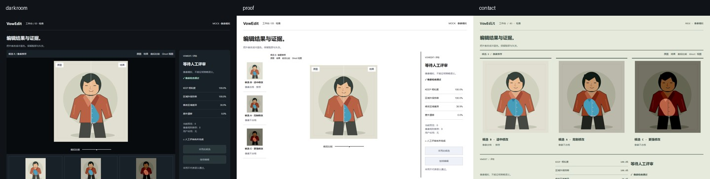

# VowEdit UI polish

## 方向与范围

选定「暗房校样台」：深色工作区承托真实图片，薄荷色标识主动作，暖色 CHANGE 与蓝色 KEEP 保持边界区分。比较图、三张候选和右侧判断栏形成一个工作台；小屏依次展开，保留完整的审批、错误和人工判断。

实施前查看了隔离 Mock 的真实页面。用同一原图、同一三候选和待人工评审状态制作了三种布局：暗房校样台、白色校对页、接触印样。暗房方向能同时容纳大图和邻近的评审信息，因此用于正式产品。下面是探索小样，**不是运行产品或新增路由**。

实际使用 [oil-ui 0.16.5](https://github.com/oil-oil/oil-ui/tree/e4c8f60be407a4f1ec28459eb782e8eb94447888)，安装来源 SHA 为 `e4c8f60be407a4f1ec28459eb782e8eb94447888`。已读取设计方向、视觉语言、布局与视口、风格比较、动效、工具和评审指导，并实际运行比较页生成器和截图工具。Skill 与完整静态探索保存在 Git ignored 的任务产物中，没有加入产品运行时。更新检查按受控目录要求跳过。

## 实现

- 共享 CSS tokens、中文字体层级、表面、控件、焦点、禁用状态、响应式布局用于首页、编辑、结果、草稿、审批、活动与历史。
- 编辑画布根据素材比例和视口高度显示；绘制坐标仍由原有 source geometry 决定。
- 结果页标题置于活动入口之前；图片与所有比较层使用同一自然比例，缩略图完整显示。像素推荐、当前预览、人工判断与采用仍独立显示。
- 草稿将原图／已保存蒙版与契约编辑并排组织；人工审批完整显示，保留素材加载、presentation、未保存、冲突和风险确认门槛。
- 新增模式滑动底板、工具按压与 hover、主按钮扫光、候选浮起与选中线、Ghost 外框扫描、标题和展开内容入场。动效位于控件或画布外围，不滤镜、裁切或变换证据像素，不增加虚构进度；`prefers-reduced-motion` 关闭动画与过渡。

重要实现文件：`app/globals.css`、`frontend/SiteChrome.tsx`、`MaskEditor.tsx`、`DraftEditor.tsx`、`AgentActions.tsx`、`ResultPage.tsx`。新增布局风险行为测试在 `e2e/ui-polish.spec.ts`；`e2e/agent.spec.ts` 仅增加审批截图，原断言保留。

API/schema、数据库、后端、auth/CSRF、MCP 工具、provider transport、评估和排名无改动。没有新依赖或 lockfile 变更；没有直接读取或修改真实用户 data、`.env`、凭据或工作流。发现 Next 默认会加载环境文件后，构建与浏览器验证使用不含 `.env` 的受控源代码副本。

## 前后与动效证据

截图来自本轮独立 Mock 数据与项目自有 fixture，在 Chromium 中实际操作后保存并查看。Mock 像素变化不证明语义意图、真实模型质量或 native Chrome 验收。

| 证据 | 内容 |
| --- | --- |
| [结果页 before](screenshots/ui-polish/result-before.png)／[after](screenshots/ui-polish/result-after.png) | 1440px，项目同一素材、同一待人工评审状态；独立 run 的时间与 ID 会不同 |
| [中文编辑页](screenshots/ui-polish/editor-zh.png) | 真实 CHANGE／KEEP 预览与 Mock 来源 |
| [390px／200% Ghost](screenshots/ui-polish/mobile-ghost-200.png) | 浏览器 CSS zoom=2，重要控制重排；不是设备像素比放大截图 |
| [模式切换三帧](screenshots/ui-polish/motion-mode.png) | CHANGE→KEEP，260ms 过渡 |
| [主按钮三帧](screenshots/ui-polish/motion-primary.png) | hover 检查契约按钮，600ms 扫光 |
| [标题入场三帧](screenshots/ui-polish/motion-entry.png) | 220ms 标题入场 |

动效帧为真实浏览器截图的局部裁取。为避免短过渡被截图耗时错过，中间帧暂停浏览器已有动画到对应时刻；没有重建模拟动画。另做实时测量：模式底板 transform 从无变换经过中间位移到最终位移；主按钮 `action-sweep`、Ghost `ghost-scan` 实际触发。减少动态效果时，Ghost 为 `animation-name: none`，模式过渡为 `0s`。

完整比较页在本地任务产物 `.local/ui-polish/exploration/style-explorer.html`，包含基线与三个小样；完整截图、录屏与报告在 `.local/ui-polish/`，不纳入生产代码。oil-ui 自动 motion 探测曾报告 0；补充实际帧与浏览器测量核验了伪元素滑动、背景扫光和短入场，未把截图保存成功当成动效通过。工具还报告既有缺失 `/favicon.ico` 的 404，不影响产品请求。

## 本轮验证

本地验证在不含 `.env` 或真实用户数据的受控源代码副本运行；API 使用绝对隔离数据目录、`PYTHON_DOTENV_DISABLED=1`、Mock，并清理继承的真实 provider 配置。

| Gate | 本轮结果 |
| --- | --- |
| ESLint | PASS |
| TypeScript／Next route typegen | PASS |
| Frontend Vitest | PASS，3 files／11 tests |
| Production build | PASS |
| 完整 Chromium E2E | PASS，38 tests；含本轮新增 5 tests |
| npm audit（high 门槛） | PASS，0 vulnerabilities |
| Repository secret patterns／git diff --check | PASS |

完整 E2E 覆盖画笔→契约→三候选→slider／Ghost／报告→人工 FAIL／采用→继续、刷新与 lineage；Agent stdio fixture 的保存／冲突／提案／批准／拒绝／恢复；导入、Boundary Lock、错误重试和 lost-response 幂等性。后端与 MCP 无改动，本地未重新开展宿主配置验收；现有 Hosted CI 的完整门禁继续保留。

新增行为测试在 1440、1024、768、390、360px 与 CSS zoom=1／2 下验证画布与原图几何、pointer-to-source 像素、键盘绘制／undo、横向溢出、中文长指令、reduced-motion，以及最终提交的 640×704 CHANGE PNG 中已画／撤销像素。另实际操作中文结果，在相同五档与两种缩放下检查横向溢出，10 组通过。人工查看代表性编辑、审批待确认、生成、失败、三候选、slider、Ghost、收据／FAIL、采用／继续、活动与历史页面；这不是每页×语言×尺寸的穷举视觉验收。

独立只读截图评审未发现 BLOCKING／IMPORTANT；工程 self-review 检查了共享 CSS、自然比例、坐标、焦点／禁用、审批条件、风险确认、异步恢复与 i18n。未删除安全说明或放宽原有断言。

## 限制与交付边界

- 360px／200% 的原生 provider select 会截短完整选中名称；Mock 标识与“不调用模型”的说明保留。独立评审记录为 NIT。
- 200% 验证采用浏览器 CSS zoom 与独立视口重排，未宣称通过原生 Chrome 浏览器菜单缩放或 native Chrome／Edge 人工验收。
- 独立评审仅看图与动效帧，未独立操作浏览器或播放录屏；全部动画的 reduced-motion 未逐项独立复现。
- Real provider：NOT TESTED。Docker：NOT TESTED（仓库无 Docker 配置）。生产部署／真实宿主 MCP：NOT TESTED。
- 完整探索和大录屏为忽略的任务产物。仅提交少量无凭据的 fixture 图片。没有 merge、tag、release 或 deploy。

交付分支 `codex/vowedit-ui-polish`，基于已合入 V0.3 的 `feat/vowedit-v0.1-hardening`，base／merge-base 为 `8bb5c722bd8270b102f51cda9fa7f17b0bd991e4`。最终 HEAD、Draft PR 与同 SHA 的 Hosted CI 以 PR 和交付报告为准；本文件不以历史 CI 代替本轮结果。
